<h3><code>sanket@github ~ $ ./contributions.sh</code></h3>

  

<h3><code>sanket@github ~ $ whoami</code></h3>

<table>
<tr>
<td valign="top">

</td>

<td valign="top">

</td>
</tr>
</table>

 

<h3><code>sanket@github ~ $ cat about.txt</code></h3>

<b>Computer Engineering Student • AI Explorer • Full-Stack Creator • Problem Solver</b>

I build practical technology for real-world problems, especially at the intersection of
AI, agriculture and web development.

Currently exploring <b>Python • C/C++ • Java • AI/ML • Full-Stack Development • Cloud</b>.

 

<h3><code>sanket@github ~ $ ./projects.sh</code></h3>

<table>
<tr>

<td width="50%" valign="top">

### 🌾 KrushiScan AI

AI-powered agriculture assistant for farmers, focused on crop disease detection, weather intelligence and voice-first guidance in regional languages.

</td>

<td width="50%" valign="top">

### 📊 Smart Mandi

A farmer-focused mandi price advisor that compares market prices, transport costs and expected net returns to support better selling decisions.

</td>

</tr>

<tr>

<td width="50%" valign="top">

### 🍊 AI Orange Plant Selection

A computer-vision concept for helping farmers evaluate and select suitable orange plants using image-based analysis.

</td>

<td width="50%" valign="top">

### 💻 Portfolio

My developer portfolio, projects, experiments and learning journey.

</td>

</tr>
</table>

 

<h3><code>sanket@github ~ $ tech-stack</code></h3>

 

<h3><code>sanket@github ~ $ connect</code></h3>

 

⚡ Building. Learning. Shipping. Repeating.

